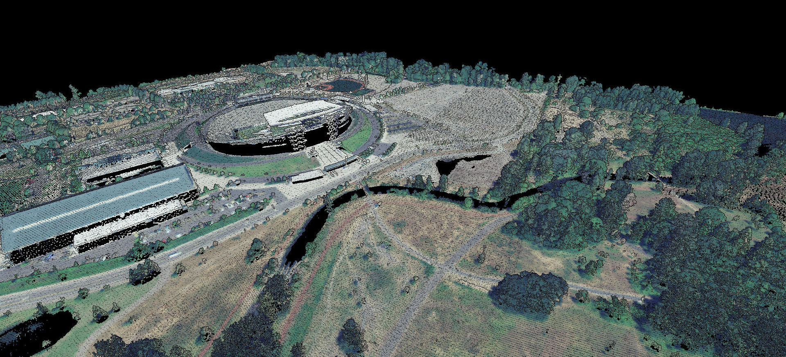

 

# lidRviewer

This is a point cloud viewer for R. The primary goal of this package is to serve as an alternative backend for displaying point clouds in the [lidR](https://github.com/Jean-Romain/lidR) package, replacing `rgl`.

While `rgl` is a powerful package, it has some limitations when it comes to handling large point clouds. The `lidRviewer` package is designed to efficiently display arbitrarily large in-memory point clouds, with tested cases including over 880 million points.



### Advantages of `lidRviewer`:

* Capable of handling hundred millions of points efficiently if they fits in memory, unlike `rgl`, which may struggle with a few million.
* More memory efficient: it requires less additional memory than `rgl` that may require gigabytes to store a full copy of the point cloud.
* Provides keyboard controls for changing coloring attributes and point size on-the-fly.
* Features eyes-dome lighting for better visualization.

### Drawbacks:

* Limited functionality: only displays point clouds and does not offer additional features. It is not intended to replace `rgl` for other visualization needs and custom rendering.
* Limited to only one windows and thus one rendering.

## Installation

```r
devtools::install_github("lidRviewer", repos = 'https://r-lidar.r-universe.dev')
```

## Usage

```r
library(lidR)
library(lidRviewer)
LASfile <- system.file("extdata", "Megaplot.laz", package="lidR")
las <- readLAS(LASfile)
view(las)
# Close the view to continue working in your R session
```

- Rotate with left mouse button
- Zoom with mouse wheel
- Pan with right mouse button
- Keyboard <kbd>r</kbd> or <kbd>g</kbd> or <kbd>b</kbd> to color with RGB
- Keyboard <kbd>z</kbd> to color with Z
- Keyboard <kbd>i</kbd> to color with Intensity
- Keyboard <kbd>c</kbd> to color with Classification
- Keyboard <kbd>+</kbd> or <kbd>-</kbd> to change the point size
- Keyboard <kbd>l</kbd> to enable/disable eyes-dome lightning

## Technical details

`lidRviewer` is based on [Markus Schultz thesis](https://www.cg.tuwien.ac.at/research/publications/2016/SCHUETZ-2016-POT/) with some adaptation and variation. One of the main difference is that Potree spatially indexes the point cloud in dedicated and optimized files on-disk file for an out-of-core rendering. `lidRviewer` on its side creates a nested octree on-the-fly on an in-memory `data.frame` without modifying the original data (not sorting, no data layout optimization).
